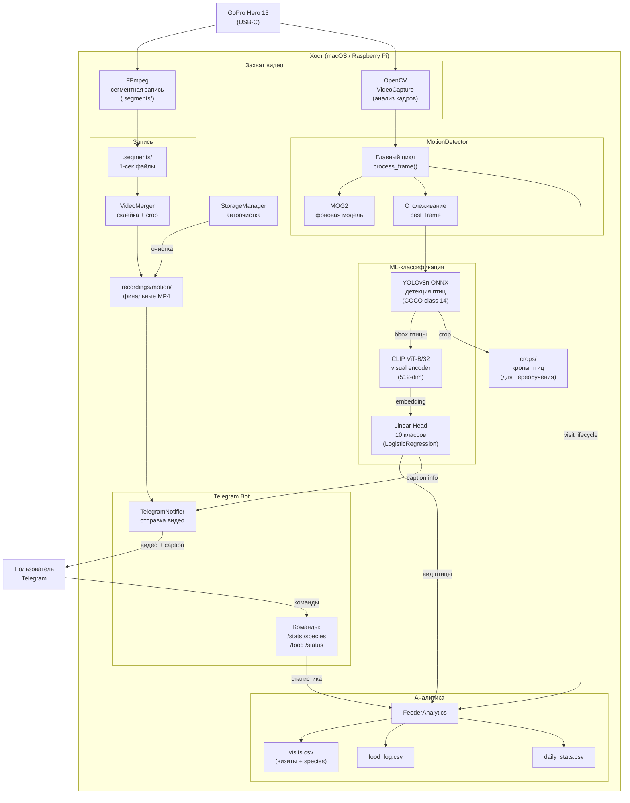
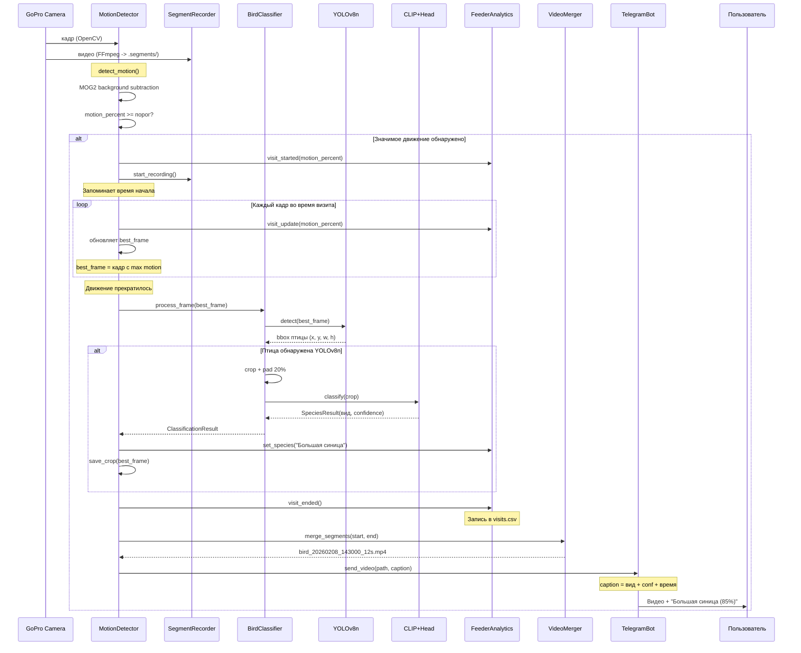
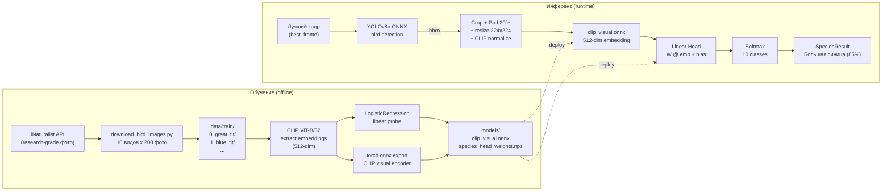
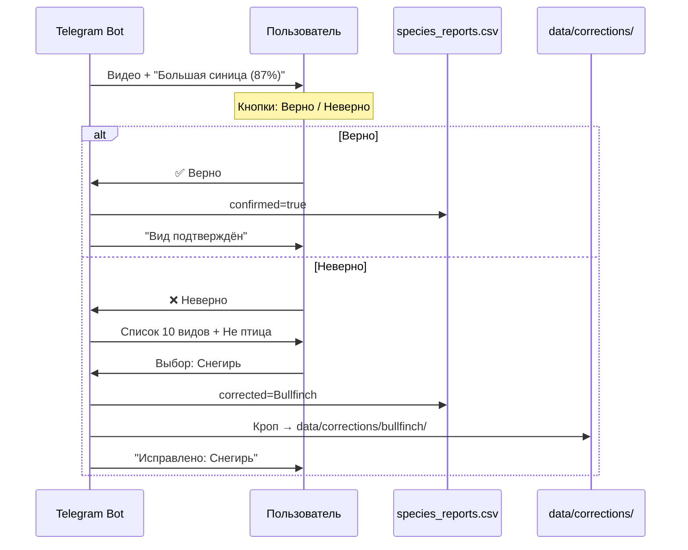

# ML-распознавание видов птиц

Автоматическая детекция и классификация птиц на кормушке.

## Архитектура сервиса

### Общая схема системы

Все компоненты и потоки данных:



### Последовательность обнаружения птицы

Полный цикл от кадра камеры до Telegram-уведомления:



### ML-пайплайн: обучение и инференс

Два режима работы ML-компонента:



## ML-пайплайн

Двухстадийный пайплайн классификации:

1. **YOLOv8n** -- детекция птицы в кадре
   (COCO class 14 = "bird")
2. **CLIP ViT-B/32 + Linear Probe** --
   классификация вида (10 классов)

### Поддерживаемые виды (10 классов)

| ID | Русское название        | English           | Латынь                |
|----|------------------------|-------------------|-----------------------|
| 0  | Большая синица         | Great Tit         | Parus major           |
| 1  | Лазоревка              | Blue Tit          | Cyanistes caeruleus   |
| 2  | Домовый воробей        | House Sparrow     | Passer domesticus     |
| 3  | Полевой воробей        | Tree Sparrow      | Passer montanus       |
| 4  | Поползень              | Nuthatch          | Sitta europaea        |
| 5  | Снегирь                | Bullfinch         | Pyrrhula pyrrhula     |
| 6  | Большой пёстрый дятел  | Great Sp. Woodp.  | Dendrocopos major     |
| 7  | Зеленушка              | Greenfinch        | Chloris chloris       |
| 8  | Чиж                    | Siskin            | Spinus spinus         |
| 9  | Свиристель             | Waxwing           | Bombycilla garrulus   |

## Быстрый старт

### 1. Установка зависимостей

**Для production-инференса** (macOS / Raspberry Pi):

```bash
pip install -r detector/requirements.txt
# Содержит: onnxruntime>=1.17.0, numpy, opencv
```

**Для обучения** (macOS / PC с GPU):

```bash
pip install -r scripts/requirements-train.txt
# Содержит: open_clip_torch, torch, scikit-learn,
# onnxruntime, onnxscript
```

### 2. Загрузка данных для обучения

Скрипт скачивает research-grade фотографии с iNaturalist:

```bash
python scripts/download_bird_images.py \
    --output_dir data/train \
    --per_species 200 \
    --geo europe
```

**Параметры:**

| Параметр       | Описание                          | Default      |
|----------------|-----------------------------------|--------------|
| `--output_dir` | Директория для сохранения         | `data/train` |
| `--per_species`| Количество фото на вид            | `200`        |
| `--geo`        | Гео-фильтр: europe/moscow/russia | `europe`     |
| `--species`    | Конкретный вид (english name)     | все          |

**Структура данных после загрузки:**

```
data/train/
├── 0_great_tit/
│   ├── 0001.jpg
│   ├── 0002.jpg
│   └── ...
├── 1_blue_tit/
│   └── ...
├── ...
├── 9_waxwing/
│   └── ...
└── manifest.csv
```

### 3. Обучение классификатора

```bash
python scripts/train_species_classifier.py \
    --data_dir data/train \
    --output_dir models \
    --device auto
```

**Параметры:**

| Параметр            | Описание                      | Default      |
|---------------------|-------------------------------|--------------|
| `--data_dir`        | Директория с фото             | `data/train` |
| `--output_dir`      | Директория для моделей        | `models`     |
| `--batch_size`      | Размер батча CLIP             | `32`         |
| `--device`          | Устройство: auto/cpu/cuda/mps | `auto`       |
| `--clip_model`      | Модель CLIP                   | `ViT-B-32`   |
| `--test_size`       | Доля валидации                | `0.2`        |
| `--skip_onnx_export`| Не экспортировать ONNX        | `false`      |

**Пайплайн обучения:**

1. Загрузка изображений из поддиректорий
2. Извлечение 512-dim CLIP-эмбеддингов
3. Обучение LogisticRegression (linear probe)
4. Экспорт CLIP visual encoder в ONNX
5. Сохранение весов linear head в `.npz`
6. Генерация `training_report.json`

**Выходные файлы:**

```
models/
├── clip_visual.onnx       # CLIP visual encoder (~1MB + .data)
├── clip_visual.onnx.data  # Веса модели (~340MB)
├── species_head_weights.npz # Linear head (~50KB)
├── species_labels.json    # Маппинг классов
├── clip_embeddings.npz    # Кеш эмбеддингов (для повторного обучения)
├── training_report.json   # Отчёт с метриками
└── yolov8n.onnx           # YOLOv8n детектор (~13MB, автозагрузка)
```

### 4. Включение в конфигурации

В файле `config.env` / `config.macos.env`:

```env
# Включить ML-детекцию
ML_ENABLED=true

# Директория с моделями
ML_MODEL_DIR=./models

# Порог уверенности (YOLOv8n детекция)
ML_CONFIDENCE_THRESHOLD=0.5

# Включить классификацию вида (CLIP)
ML_SPECIES_ENABLED=true

# Сохранять кропы для будущего переобучения
ML_SAVE_CROPS=true
ML_CROPS_DIR=./crops
```

### 5. Запуск

```bash
# С конфигом
python detector/motion_detector.py \
    --config config.macos.env

# Или с параметрами CLI
python detector/motion_detector.py \
    --ml-enabled \
    --ml-species-enabled
```

## Telegram-команды

- `/species` — статистика посещений по видам птиц
- `/stats` — общая статистика визитов (включая виды)
- `/help` — справка по командам и кнопкам

При обнаружении птицы в caption видео добавляется вид:

```
🐦 Большая синица (85%)
📹 Длительность: 12с
```

### Обратная связь по классификации

Под каждым видео с определённым видом птицы
отображаются inline-кнопки:

- **✅ Верно** — подтвердить, что вид определён
  правильно
- **❌ Неверно** — указать правильный вид из
  списка 10 классов или отметить «Не птица»



Репорты сохраняются в `analytics/species_reports.csv`:

| Поле | Описание |
|------|----------|
| `timestamp` | Время репорта |
| `visit_id` | ID визита |
| `original_species` | Исходный вид (EN) |
| `corrected_species` | Исправленный вид |
| `confirmed` | true/false |
| `video_file` | Имя видеофайла |

## Структура кода

| Файл                              | Описание                        |
|-----------------------------------|---------------------------------|
| `detector/bird_classifier.py`     | BirdDetector + SpeciesClassifier|
| `detector/feeder_analytics.py`    | Аналитика с полем species       |
| `detector/telegram_bot.py`        | Бот + inline-репорты ошибок     |
| `models/species_labels.json`      | Маппинг class_id → названия     |
| `analytics/species_reports.csv`   | Репорты обратной связи          |
| `data/corrections/`              | Кропы с исправлениями           |
| `scripts/download_bird_images.py` | Загрузка данных с iNaturalist   |
| `scripts/train_species_classifier.py` | Обучение CLIP linear probe  |
| `scripts/requirements-train.txt`  | Зависимости для обучения        |

## Переобучение модели

### Добавление новых данных

Кропы птиц автоматически сохраняются в `crops/YYYY-MM-DD/`.

**Автоматически через Telegram-репорты:**

Когда пользователь нажимает «Неверно» и выбирает
правильный вид, кроп автоматически копируется в
`data/corrections/{species_en}/`. Эти данные можно
использовать для переобучения:

```bash
# Скопировать исправления в обучающую выборку
cp data/corrections/bullfinch/*.jpg \
   data/train/5_bullfinch/

# Переобучить модель
python scripts/train_species_classifier.py \
    --data_dir data/train \
    --output_dir models
```

**Вручную:**

```bash
# Разложите кропы по папкам видов
mv crops/2025-01-15/visit_0001_bird_0.jpg \
   data/train/0_great_tit/custom_001.jpg

# Переобучите (эмбеддинги пересчитаются)
python scripts/train_species_classifier.py \
    --data_dir data/train \
    --output_dir models
```

### Добавление нового вида

1. Добавить вид в `scripts/download_bird_images.py`
   (массив `SPECIES`, новый `class_id`)
2. Обновить `models/species_labels.json`
3. Скачать фотографии нового вида
4. Переобучить классификатор

## Производительность

| Метрика               | Значение          |
|-----------------------|-------------------|
| Accuracy (10 классов) | ~80% (val, 10K)   |
| Датасет               | 10 000 фото       |
| Inference YOLOv8n     | ~15ms (CPU M5)    |
| Inference CLIP visual | ~50ms (CPU M5)    |
| RAM модели            | ~400MB            |

### Что хранится в репозитории

| Файл | Размер | В репе |
|------|--------|--------|
| `species_head_weights.npz` | 22KB | Да |
| `species_labels.json` | 618B | Да |
| `clip_visual.onnx` + `.data` | 337MB | Нет |
| `yolov8n.onnx` | 13MB | Нет |

Тяжёлые ONNX-модели генерируются скриптом обучения
или скачиваются автоматически при первом запуске.

## Планы по улучшению качества

### MLP-голова (вместо linear probe)

Текущая линейная голова (LogisticRegression) упёрлась
в потолок ~80%. Замена на MLP (512→256→128→10 с ReLU)
позволит выучить нелинейные границы между похожими
видами (House Sparrow vs Tree Sparrow, и т.д.).
Ожидаемый прирост: **+3-5%**.

### Специализированный backbone

CLIP ViT-B/32 — общая модель, не обученная на птицах.
Переход на специализированный backbone:
- **BioCLIP** — CLIP, дообученный на iNaturalist
- **NABirds ViT** — fine-tuned на 555 видах птиц

Ожидаемый прирост: **+10-15%**.
Архитектура `SpeciesClassifier` поддерживает замену
backbone без изменения остального кода.

## Fallback: MobileNetV3

Если CLIP слишком тяжёлый для Raspberry Pi,
запланирован fallback на MobileNetV3 (~10MB).
Архитектура `SpeciesClassifier` поддерживает замену
backbone без изменения остального кода.
